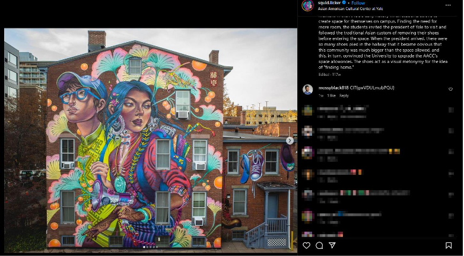

## Challenge 1: Stalking 101

### Description: 
Hi, my name is Amos. I'm a big fan of the University of New Haven Chargers, and I just learned about this new social media called X! Pretty dumb name. Find my handle for some points.

### Solution 1: 
- Elon tried to be slick when he changed the Twitter UI so you can only see a maximum of 50 followers, but no one liked it and some people decided to turn it back to how it was. Use a browser extension like “Old Twitter Layout (2024)” or many others to be
able to view everyone who follows an account. CTRL+F to find a guy named Amos:

    

### Solution 2: 
- Some folks had success with advanced search. This was unintended, but the cool thing about OSINT is that there really can’t be an “unintended” way to find public information. Whatever works, works.

**FLAG**: `CIT{@mossyblack818}`

## Challenge 2: Who even is that guy?

### Description:
- Good job finding Amos on X! Who is he inspired by?

### Solution: 
- Nothing pops out as inspirational after looking through Amos’s tweets, but we do see this:

    

 

- Sure enough, Amos has the same username on Instagram. He has only one post here:

    

Looks like we’ve found his inspiration, but who even is this guy? Many people got hung up on reverse image searching with Google or Yandex, but the OSINT Framework gives us a lot of other good options. 

    

My favorite tool for image searching is PimEyes. It’s paywalled, but you don’t need a subscription to find our guy.

    

If you click on the first result, you get a partial URL that we can assume leads to https://findsatoshi.com

    

That’s our guy! Read through the site for a fun story about a real 14 - year-long OSINT challenge that was solved with PimEyes a few years ago.

**FLAG**: `CIT{Satoshi}`

## Challenge 3 : A conservative sandwich-heavy portfolio

### Description: 
- Not even the most difficult man to find can hide from you. But what about Amos's favorite local restaurant?

### Solution: 
- You may have noticed that Amos has a link in his profile to github.com and a hashtag #gitgood on the Satoshi photo. If you didn’t then you for sure didn’t find the restaurant. We know that Amos reused his Twitter username on Instagram, but a search on
GitHub doesn’t reveal anything. However, the 1337 h4x0r5 know that people often make slight changes to usernames or passwords across platforms. Maybe as a student, Amos decided to use his real name on his GitHub account so that he can put it on his resume?

    

The reference to University of New Haven in his “About Me” repo seals the deal. But things change all the time on GitHub. In fact, this repo has 4 commits:

    

Search the commit history to find that a link was added and then removed.

    

The link leads to an image with some utensils and maybe a restaurant menu:

    

The QR code in the image leads to https://rubambarestaurant.com for the solution.

**FLAG**: `CIT{Rubamba}`

## Challenge 4 : The Walls Have Ears... and Tentacles?

### Description: 
- There's a mural nearby the restaurant. Find the artist to find the flag.

### Solution: 
- This one is tough because it’s actually easy, but instincts made it harder for most. Upon reading the description, most people tried to look at the restaurant’s surroundings via Google Maps. Many found a nearby mural, but did not note that the Maps image was from 2019.

    

A lot can happen in 5 years. Like a really big mural popping up across the street. We know from Maps that the restaurant is near the corner of High and Crown. The first result from Googling “Murals near High St. New Haven” will give you a link to newhavenarts.org:

    

In this article, we learn that the artist’s Instagram handle is @squid.licker. That may seem like the final answer, but the description didn’t ask who made the mural. It said we had to
find the artist to find the flag. We know our friend Amos has an Instagram account, so maybe he noticed the mural while he was out at his favorite restaurant and decided to share his thoughts with the artist:

    

**FLAG**: `CIT{gwVDULmubPQU}`

## Challenge 5 : Rainbolt Jr.

### Description: 
- Email Amos for the final flag.
 
### Solution: 
- After the fiasco of finding that mural, I thought you all deserved a break. No clues to follow here, just good ol’ guestimation based on what we already know:

Email amosblack818@gmail[.]com and receive an OOO auto return with the flag.

**FLAG**: `CIT{jeaaabKQpjfC}`